# GitHub Copilot Model Comparison Table

This comparison was generated using the custom prompt file [model-compare.prompt.md](../.github/prompts/model-compare.prompt.md) and reflects the latest information from GitHub's official documentation.

> [!NOTE]
> As the AI model landscape evolves rapidly, this information may become outdated. Refer to the [official GitHub documentation](https://docs.github.com/en/copilot/using-github-copilot/ai-models/choosing-the-right-ai-model-for-your-task) for the most current details.

## 1. General-Purpose Coding and Writing

**Pros:** 🎯 Versatile, 🚀 fast, 💡 accurate, balanced quality/speed/cost.

*Use for: Common development tasks, writing/reviewing functions, generating documentation, explaining errors, working in non-English programming environments.*

| Model | Use Case / Differentiator | GA/Preview | Special Abilities | Multiplier |
|-------|---------------------------|------------|-------------------|------------|
| GPT-4.1 | 🏆 Reliable default for most coding tasks | ✅ | 🔧 Agent mode, 👓 Vision | 0x (paid), 1x (free) |
| GPT-5-Codex | 🎯 Higher-quality code for complex engineering | 🚧 | 🔧 Agent mode | 1x |
| Claude Sonnet 3.7 | 📝 Clear, structured output with consistent style | ✅ | 🔧 Agent mode, 👓 Vision | 1.25x |
| Gemini 2.0 Flash | ⚡ Fast and cost-effective for quick tasks | ✅ | 👓 Vision | 0.25x 💸 |
| o4-mini | 🏃‍♂️ Optimized for speed and cost efficiency | ✅ | Lower latency | 0.25x 💸 |
| Grok Code Fast 1 | ⚡ Specialized for coding tasks | 🚧 | 🔧 Agent mode | 0.33x |

## 2. Fast Help with Simple or Repetitive Tasks

**Pros:** 🚀 Speed, ⚡ low latency, 💸 cost savings, quick feedback.

*Use for: Small functions/utility code, quick syntax questions, prototyping, fast feedback on simple edits.*

| Model | Use Case / Differentiator | GA/Preview | Special Abilities | Multiplier |
|-------|---------------------------|------------|-------------------|------------|
| o4-mini | 🏃‍♂️ Quick and cost-effective for repetitive tasks | ✅ | Lower latency | 0.25x 💸 |
| Claude Sonnet 3.5 | ⚖️ Balances fast responses with quality output | ✅ | 🔧 Agent mode, 👓 Vision | 1x |
| Gemini 2.0 Flash | ⚡ Extremely low latency, multimodal support | ✅ | 👓 Vision | 0.25x 💸 |

## 3. Deep Reasoning and Debugging

**Pros:** 🧠 Advanced reasoning, 🔍 debugging, 🏗️ architecture decisions, multi-step problem solving.

*Use for: Complex refactoring, debugging multi-file issues, architectural planning, performance analysis, weighing trade-offs.*

| Model | Use Case / Differentiator | GA/Preview | Special Abilities | Multiplier |
|-------|---------------------------|------------|-------------------|------------|
| GPT-5 mini | 🧠 Deep reasoning with faster responses than GPT-5 | 🚧 | Reasoning, 👓 Vision | 1x |
| GPT-5 | 🎯 Complex reasoning and technical decision-making | � | Reasoning | 1x |
| o3 | 🏗️ Algorithm design, system debugging, architecture | 🚧 | Reasoning | 10x 💰 |
| Claude Sonnet 3.7 | 🔄 Hybrid reasoning adapting to fast/deep tasks | ✅ | � Agent mode, 👓 Vision | 1.25x |
| Claude Sonnet 4 | ⚡ Improved reliability and smarter reasoning | ✅ | 🔧 Agent mode, 👓 Vision | 1x |
| Claude Opus 4.1 | 🏆 Anthropic's most powerful model | ✅ | Reasoning, 👓 Vision | 10x 💰 |
| Claude Opus 4 | 🎯 Strategy, debugging, multi-layered logic | ✅ | Reasoning, 👓 Vision | 10x 💰 |
| Gemini 2.5 Pro | 🔬 Advanced reasoning, long contexts, technical analysis | ✅ | Reasoning, 👓 Vision | 1x |

## 4. Working with Visuals (Diagrams, Screenshots)

**Pros:** 👓 Visual reasoning, �️ multimodal input, UI/diagram analysis, front-end debugging.

*Use for: Questions about diagrams/screenshots/UI, visual feedback on drafts, understanding front-end behavior from visual context.*

| Model | Use Case / Differentiator | GA/Preview | Special Abilities | Multiplier |
|-------|---------------------------|------------|-------------------|------------|
| GPT-4.1 | 🏆 Reliable default with multimodal support | ✅ | 🔧 Agent mode, 👓 Vision | 0x (paid), 1x (free) |
| Claude Opus 4 | 🧠 Powerful model with visual capabilities | ✅ | Reasoning, 👓 Vision | 10x 💰 |
| Claude Sonnet 4 | ⚡ Reliable completions with visual reasoning | ✅ | 🔧 Agent mode, 👓 Vision | 1x |
| Gemini 2.0 Flash | ⚡ Fast multimodal for real-time visual feedback | ✅ | 👓 Vision | 0.25x 💸 |
| Gemini 2.5 Pro | 🔬 Deep reasoning for complex visual analysis | ✅ | Reasoning, � Vision | 1x |

---

## References

- [Choosing the right AI model for your task](https://docs.github.com/en/copilot/using-github-copilot/ai-models/choosing-the-right-ai-model-for-your-task)
- [About premium requests](https://docs.github.com/en/enterprise-cloud@latest/copilot/managing-copilot/monitoring-usage-and-entitlements/about-premium-requests?versionId=enterprise-cloud%40latest)

---

## Model Summary Overview: Performance vs. Quality & Cost

```mermaid
graph LR
    %% Performance Category (Low Cost/Fast)
    subgraph "🚀 Performance (Speed & Cost Optimized)"
      direction TB
      o4m["o4-mini<br/>🚀💸 (0.25x)<br/>✅ GA"]
      g2f["Gemini 2.0 Flash<br/>⚡ (0.25x)<br/>✅ GA"]
      grok["Grok Code Fast 1<br/>⚡� (0.33x)<br/>🚧 Preview"]
      o4m --> g2f
      g2f --> grok
    end

    %% Balanced Category
    subgraph "⚖️ Balanced (General Purpose)"
      direction TB
      g41["GPT-4.1<br/>🏆🔧👓 (0x/1x)<br/>✅ GA"]
      c35s["Claude 3.5 Sonnet<br/>🔧👓 (1x)<br/>✅ GA"]
      c4s["Claude Sonnet 4<br/>⚡🔧👓 (1x)<br/>✅ GA"]
      g5c["GPT-5-Codex<br/>🎯� (1x)<br/>🚧 Preview"]
      g25p["Gemini 2.5 Pro<br/>🔬👓 (1x)<br/>✅ GA"]
      g41 --> c35s
      c35s --> c4s
      c4s --> g5c
      g5c --> g25p
    end

    %% Quality & Cost Category (High Performance/Expensive)
    subgraph "🧠 Deep Reasoning (Premium Models)"
      direction TB
      c37s["Claude 3.7 Sonnet<br/>🔄🔧👓 (1.25x)<br/>✅ GA"]
      g5m["GPT-5 mini<br/>🧠� (1x)<br/>🚧 Preview"]
      g5["GPT-5<br/>🎯🧠 (1x)<br/>🚧 Preview"]
      o3["o3<br/>🏗️ (10x)<br/>🚧 Preview"]
      c4o["Claude Opus 4<br/>🎯💰 (10x)<br/>✅ GA"]
      c41o["Claude Opus 4.1<br/>🏆💰 (10x)<br/>✅ GA"]
      c37s --> g5m
      g5m --> g5
      g5 --> o3
      o3 --> c4o
      c4o --> c41o
    end

    %% Cross-category connections
    grok -.-> g41
    g25p -.-> c37s

    %% Styling with high contrast colors for readability
    style o4m fill:#e1f5fe,stroke:#01579b,stroke-width:3px,color:#000
    style g2f fill:#e1f5fe,stroke:#01579b,stroke-width:3px,color:#000
    style grok fill:#e1f5fe,stroke:#01579b,stroke-width:3px,color:#000
    
    style g41 fill:#f3e5f5,stroke:#4a148c,stroke-width:3px,color:#000
    style c35s fill:#f3e5f5,stroke:#4a148c,stroke-width:3px,color:#000
    style c4s fill:#f3e5f5,stroke:#4a148c,stroke-width:3px,color:#000
    style g5c fill:#f3e5f5,stroke:#4a148c,stroke-width:3px,color:#000
    style g25p fill:#f3e5f5,stroke:#4a148c,stroke-width:3px,color:#000
    
    style c37s fill:#fff3e0,stroke:#e65100,stroke-width:3px,color:#000
    style g5m fill:#fff3e0,stroke:#e65100,stroke-width:3px,color:#000
    style g5 fill:#fff3e0,stroke:#e65100,stroke-width:3px,color:#000
    style o3 fill:#ffebee,stroke:#b71c1c,stroke-width:3px,color:#000
    style c4o fill:#ffebee,stroke:#b71c1c,stroke-width:3px,color:#000
    style c41o fill:#ffebee,stroke:#b71c1c,stroke-width:3px,color:#000
```

### Legend
- **🚀 Speed** | **💸 Cost-effective** | **🧠 Deep reasoning** | **👓 Vision support** | **🔧 Agent mode** | **💰 Premium pricing**
- **✅ GA (Generally Available)** | **🚧 Preview** 
- **Multipliers:** 0x = Free on paid plans | 0.25x-0.33x = Very cost-effective | 1x-1.25x = Standard | 10x = Premium
